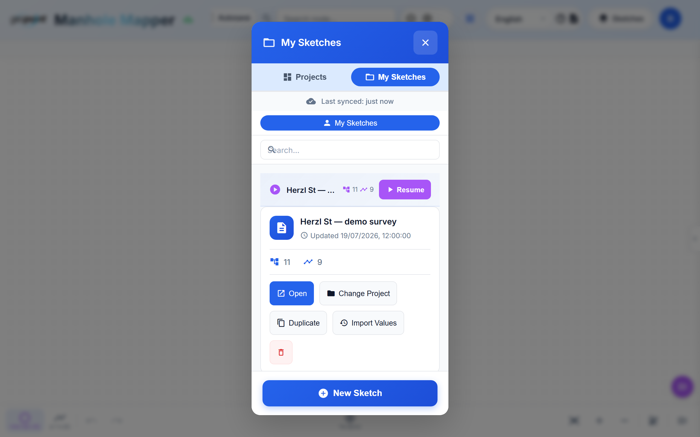
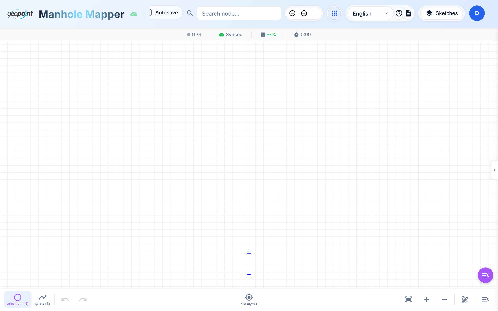
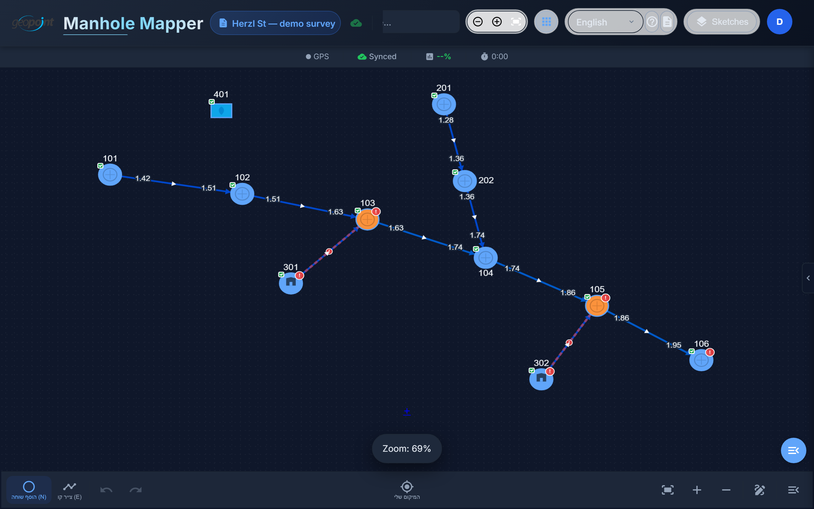

# Tutorial 1 — Getting Started

Manholes Mapper is an offline-first web app (PWA) for mapping underground
infrastructure in the field: manholes, sewer and drainage lines, and house
connections. You draw the network on a high-performance canvas, attach survey
data to every element, and export GIS-ready files.

## Opening the app

1. Browse to **https://manholes-mapper-three.vercel.app**.
2. Sign in with your email and password (accounts are created by your
   organization's admin, or via **Sign up** if self-registration is enabled).
3. On a phone or tablet, use your browser's **Add to Home Screen** — the app
   installs as a PWA and works without connectivity afterwards.

> **Offline-first:** every change you make is saved on the device immediately
> (localStorage + IndexedDB) and synced to the cloud in the background. If you
> lose signal mid-survey, keep working — a header chip shows the offline state
> and everything syncs when you're back online.

## The home screen

After signing in you land on **My Sketches** — your sketch library:

- **Resume** re-opens the sketch you last worked on.
- Each card shows the node/edge counts and last-updated time, with actions to
  **Open**, **Change Project**, **Duplicate**, or delete.
- The **Projects** tab lists project-grouped sketches (see
  [Tutorial 7](07-projects-and-teams.md)).
- **+ New Sketch** starts a fresh survey — that's [Tutorial 2](02-your-first-sketch.md).

## The main screen

Close the home dialog to see the workspace:

From top to bottom:

- **Header** — app logo, current sketch name, sync indicator, node/address
  search, zoom controls, language switcher, help, and your user menu.
- **Micro status bar** — live GPS fix quality, sync state ("Synced" /
  pending), sketch completion %, and the session timer.
- **Canvas** — the drawing surface. Pan by dragging (or hold `Space` on
  desktop), pinch or scroll to zoom.
- **Bottom toolbar** — drawing modes (add node / draw line), undo/redo, my
  location, zoom-to-fit, and the overflow menu with everything else.

## Language and theme

- **Language**: the header dropdown switches Hebrew ⇄ English instantly. The
  whole UI is RTL-aware — panels, arrows, and text flip correctly in Hebrew.
- **Dark mode**: follows your system preference by default; force it from the
  user menu. There is also an automatic mode (dark 19:00–06:00) for evening
  fieldwork:

## Keyboard shortcuts (desktop)

| Key | Action |
|-----|--------|
| `N` | Node mode (place manholes) |
| `E` | Edge mode (draw pipes) |
| `S` | Save |
| `Ctrl+Z` / `Ctrl+Shift+Z` | Undo / Redo |
| `Space` (hold) | Pan the canvas |
| `Tab` / `Shift+Tab` | Cycle through nodes/edges |
| `Enter` | Open details for the selection |
| `+` / `-` / `0` | Zoom in / out / reset |
| `Esc` | Cancel / clear selection |
| `Delete` | Delete selected item |

**Next:** [Tutorial 2 — Your first sketch](02-your-first-sketch.md)
