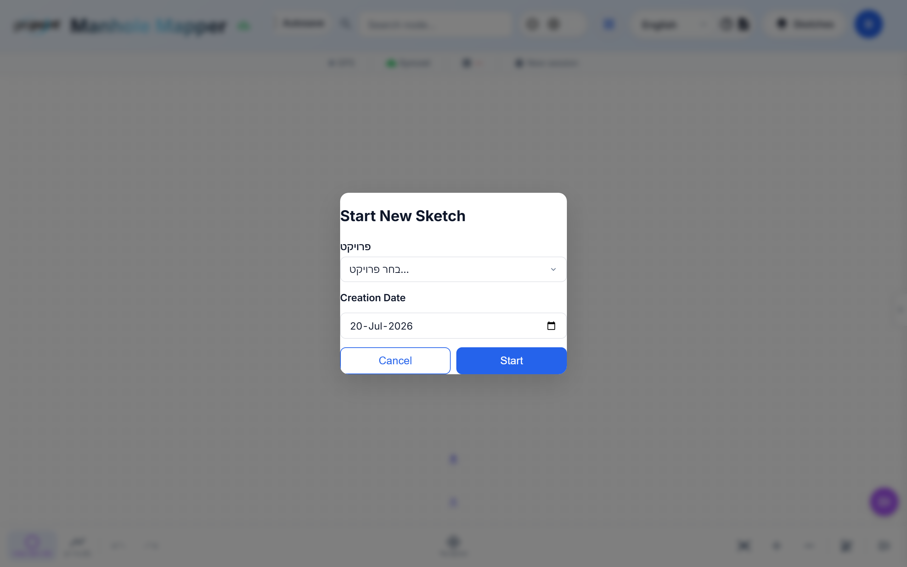

# Tutorial 2 — Your First Sketch

A *sketch* is one survey drawing: the manholes, pipes, and house connections
of a street or work area, plus all the field data attached to them.

## Create a sketch

From the home screen press **+ New Sketch**:

Give it a recognizable name (street name + date is a good convention), pick
the date, and confirm. You're dropped onto an empty canvas.

## Place manholes

1. Make sure **node mode** is active (first toolbar button, or press `N`).
2. Tap/click anywhere on the canvas — a numbered manhole appears. IDs
   auto-increment (1, 2, 3…) and always take the smallest free number.
3. Keep tapping along the street to place the run.

Long-press a node for its context menu (rename, delete, node type).

### Other node types

The node-mode button has a flyout with specialized types:

- **Manhole** — standard sewer access node.
- **Home** — a house/building connection (drawn with a house icon; its lateral
  line is rendered dashed).
- **Drainage** — stormwater node (rectangular icon).
- **Covered / For-Later / Issue** — special markers: a buried manhole, a node
  to revisit, or a field problem to report (Issue nodes support threaded
  comments — see [Tutorial 7](07-projects-and-teams.md)).

## Draw pipes

1. Switch to **edge mode** (`E`).
2. Click the upstream node, then the downstream node — a directed arrow
   (tail → head) is drawn. Flow direction matters: it drives gradient checks
   and GIS exports.
3. Click a node, then empty canvas, to draw a **dangling edge** — an open pipe
   end you'll connect later. Placing a new node near a dangling end snaps and
   connects it automatically.

On touch devices you can also **long-press a node and drag** to another node
to create an edge one-handed.

A finished street looks like this — manholes numbered, pipes labeled with
their depth measurements, house laterals dashed:

## Junctions are highlighted

Nodes where multiple mains meet are tinted orange automatically, and node
badges mark data states (green check = surveyed coordinates, red `!` =
detected issue such as a missing measurement).

## Undo, save, autosave

- Every action is undoable: `Ctrl+Z` / toolbar undo (50-step history).
- **Autosave** (header toggle) persists continuously; the cloud sync indicator
  in the status bar shows "Synced" when the server copy is current.
- Manual save: `S` or the save button.

**Next:** [Tutorial 3 — Entering field data](03-entering-field-data.md)
