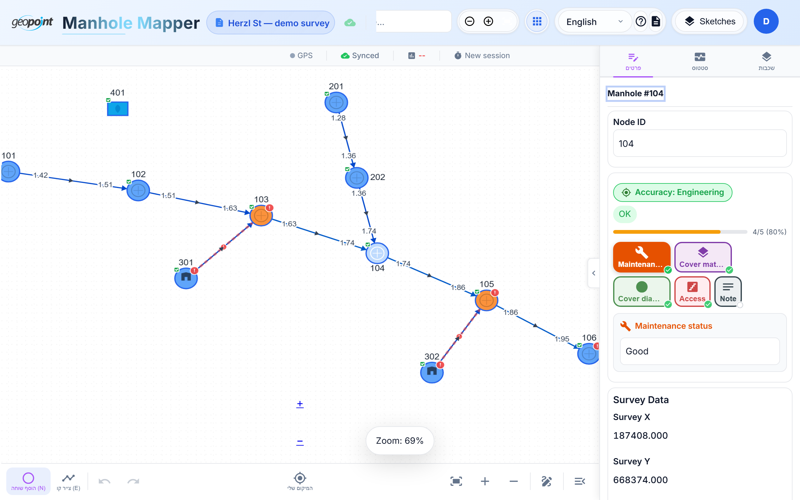
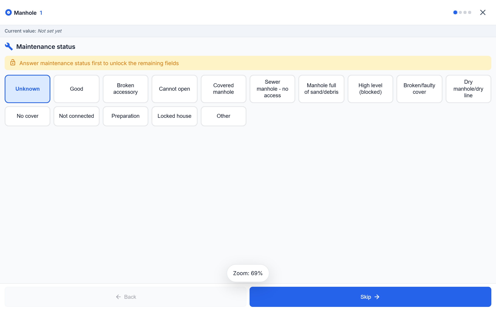
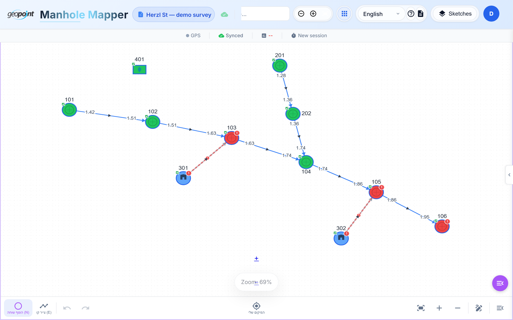

# Tutorial 3 — Entering Field Data

Geometry is half the survey; the other half is the data on every manhole and
pipe: materials, cover diameters, access, maintenance state, and — critically —
depth measurements. The app gives you two data-entry surfaces: the classic
**details drawer** and the fast **field stepper**.

## The details drawer

Tap any node (or press `Enter` with a selection) to open the details drawer:

- The header shows the entity ("Manhole #104") and its completion score.
- Field chips (Maintenance, Cover material, Cover diameter, Access, Note) show
  at a glance what's filled — green check — and what's missing.
- **Survey Data** shows the measured ITM coordinates and elevation when the
  node has been surveyed.
- Everything edits in place and saves immediately.

Tap a **pipe** to edit its data the same way — depths at both ends, line
diameter, material, and type:

## The field stepper — fast one-handed entry

For real fieldwork, open the **field stepper**: a full-screen,
one-question-per-screen flow that cuts a node's data entry from ~25 taps to
~10. It opens automatically after a survey shot ([Tutorial 5](05-survey-mode.md)),
or from the node's context menu.

- Each screen is one field, with large tap targets (44 px+ — glove-friendly).
- The progress dots at the top show where you are; **Skip** moves on without
  answering; **Back** revisits.
- The stepper is additive — the details drawer keeps working unchanged.

### Intelligent input flow

Notice the banner in the screenshot: *"Answer maintenance status first to
unlock the remaining fields."* Admins can define **input-flow rules** that
hide, disable, or reset fields based on other answers (e.g., if a manhole
"cannot be opened", depth fields are skipped). Rules are configured per
project in the admin panel ([Tutorial 7](07-projects-and-teams.md)).

## Depth measurements

Pipe depths (from cover level down to the invert) are entered per edge end —
`tail` and `head`. They matter beyond documentation:

- Edge labels on the canvas show the depths.
- With node elevations (Z) present, the app computes each pipe's **hydraulic
  gradient** and warns immediately if a segment runs uphill — while you're
  still standing at the manhole and can re-shoot.
- Blue edges = both depths entered; gray = missing data.

## The completeness heat map

Toggle **heat-map mode** (overflow menu) to color the network by data
completeness — green complete, orange missing optional fields, red missing
coordinates or flagged issues:

Use it before leaving a site: anything not green is unfinished work you can
still fix on the spot. The cockpit's completion ring (visible in landscape)
tracks the same score sketch-wide.

**Next:** [Tutorial 4 — Coordinates & map layers](04-coordinates-and-maps.md)
