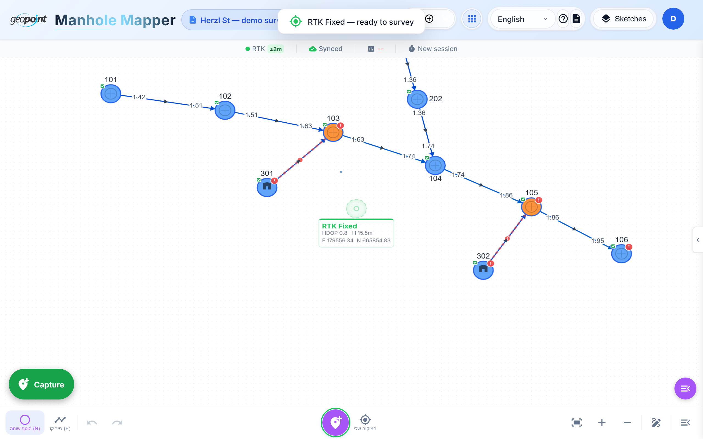
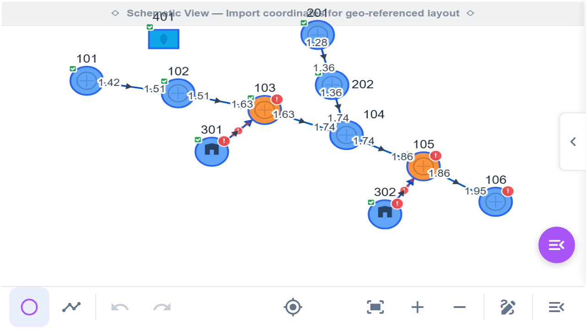

# Tutorial 5 — Survey Mode: TSC3 & GNSS

This is the app's core field workflow: survey instruments feed measured points
straight into the sketch, and the app builds the network — with correct flow
directions — as you walk the street.

## Supported hardware

| Source | Connection | Notes |
|--------|-----------|-------|
| **Trimble TSC3 controller** | Bluetooth SPP (Android app) or WebSocket bridge | Sends named points in ITM: `PointName,Easting,Northing,Elevation` |
| **Trimble R780 / R2 GNSS** | Bluetooth SPP (Android app) | NMEA GGA/RMC, RTK fix quality shown live |
| **TMM (Trimble Mobile Manager)** | Android mock location → browser geolocation | The simplest phone setup: TMM feeds RTK into the OS, the app reads it as high-accuracy browser location |
| **Browser geolocation** | Built-in | Fallback without any hardware |

Connect from the menu's **Survey** group (Bluetooth or WebSocket) or toggle
**Live Measure** for GNSS. A header badge shows the connection state, and the
status bar shows fix quality — color-coded from red **No Fix** through amber
**GPS/DGPS**, blue **RTK Float**, to green **RTK Fixed**.

*(Screenshot uses the built-in mock adapter — same UI as real hardware.)*

## The TSC3 shot workflow

1. Measure a point on the TSC3 as usual. The point arrives in the app
   instantly.
2. If the point name matches an existing node ID, the node's coordinates are
   updated (a re-measure). Otherwise the **node-type dialog** asks what you
   just shot (Manhole / Home / Drainage) — one tap.
3. The **field stepper** opens for the new node's data
   ([Tutorial 3](03-entering-field-data.md)).
4. Rapid shots queue politely — nothing steals focus while you're typing.

### Z-aware auto-connect

The app chains your shots into pipes automatically — and **sewage flows
downhill**, so it uses elevations to get the direction right:

- Clear fall between consecutive shots → the edge is created silently,
  **higher-Z → lower-Z** (even if you shot them in the other order), with an
  undoable confirmation snackbar showing the numbers ("ΔZ 0.45 m · 1.2% · 38 m").
- Flat pair, missing elevation, or a long jump (> 70 m) → the stepper's
  **CONNECT screen** asks — two direction cards plus "no connection", never a
  silent guess.
- Shooting a pair that's already connected *uphill* → you get a flip offer.
- **Home laterals** are locked Home → main and never asked about.

Every edge records where its direction came from (`chronological` / `terrain` /
`invert` / `user`), so a guessed arrow is re-checked once you enter depths —
and a user-confirmed one is never nagged.

### Measurement history

Every shot — TSC3, GNSS, or import — is appended to the node's **measurement
history** (up to 20 entries, full precision, with fix quality, HDOP, source,
and operator). Re-measuring a point never destroys the previous shot, and
sync-conflict resolution merges histories from both devices rather than
dropping either side.

## GNSS capture (Live Measure)

With a GNSS receiver connected and Live Measure on:

1. Stand on the point; watch the accuracy circle tighten.
2. Tap **Capture point** (or the quick-capture FAB). Precision-gated capture
   waits until your HRMS/VRMS thresholds are met — same behavior as Trimble
   Access.
3. Assign the fix to a node (or create one), optionally chaining an edge from
   the previous point.

## On the TSC5 controller

The app is optimized for the TSC5's 640×360 landscape screen — compact
toolbar, cockpit stats, large touch targets:

**Next:** [Tutorial 6 — The 3D underground view](06-3d-view.md)
