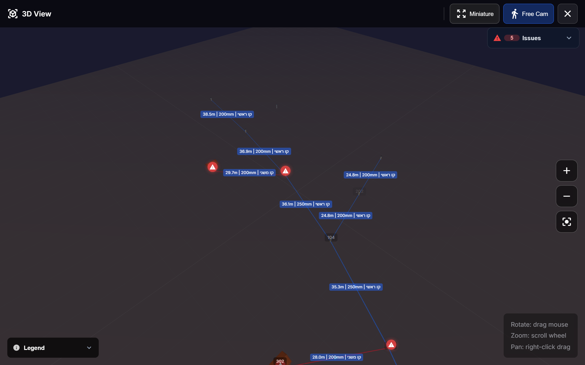

# Tutorial 6 — The 3D Underground View

One tap turns your survey into a navigable 3D scene: manhole shafts at their
measured depths, pipes at their invert levels, labels with length, diameter,
and line type. It's the fastest way to sanity-check a day's work — uphill
segments and suspicious depths jump out immediately.

## Opening it

Click the **cube button** in the toolbar (or the overflow menu). The 3D module
loads on demand — first open takes a moment; after that it's instant.

Geometry is reconstructed from your field data:

- **Manholes** — shafts from cover elevation (surveyed Z) down to their depth.
- **Pipes** — tubes between invert levels (`cover Z − depth` at each end), so
  what you see is the real vertical profile.
- **Houses** — home connections render as small buildings with their laterals.

## Getting around

| Mode | Controls |
|------|----------|
| **Orbit** (default) | Drag to rotate, scroll to zoom, right-drag to pan |
| **Free Cam** (FPS) | `WASD` + mouse-look; on touch, a virtual joystick |
| **Miniature** | Diorama mode — icon-scale geometry for a quick overview |

The frame button re-centers the camera on the network.

## Issues in 3D

The **Issues** panel (top right) lists everything the live audit found —
missing coordinates, negative gradients, long edges, missing measurements.
Red warning markers float at the problem locations; click one for the details
and fix suggestions. Fixing data in 2D updates the 3D scene the next time you
open it.

> Tip: open the 3D view after entering depths ([Tutorial 3](03-entering-field-data.md)).
> A pipe that visibly climbs uphill means a swapped direction or a bad depth —
> catch it before export, not in the office.

**Next:** [Tutorial 7 — Projects, teams & admin](07-projects-and-teams.md)
