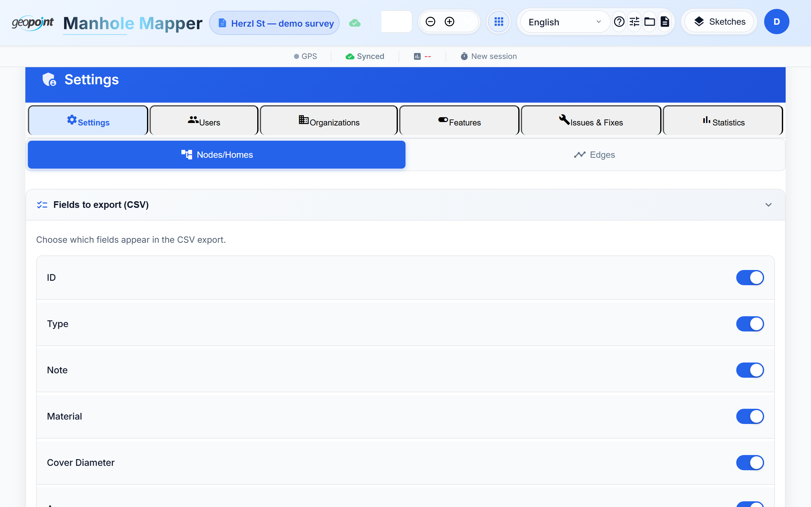

# Tutorial 7 — Projects, Teams & Admin

Manholes Mapper is multi-tenant: **organizations** contain **users** and
**projects**; projects group **sketches**. Roles decide what each person sees
and can change.

## Roles

| Role | Can |
|------|-----|
| `user` | Work on their own sketches |
| `admin` | Manage their organization's projects, sketches, users, and layers |
| `super_admin` | Everything, across organizations |

## Projects and the project canvas

Assign a sketch to a project from its card on the home screen (**Change
Project**). Opening a project (Projects tab, or `#/projects`) gives you the
**project canvas** — every sketch in the project merged into one city-wide
view:

- The **side panel** lists sketches with per-sketch stats and lets you toggle
  their visibility; the active sketch is editable, the rest render as
  background.
- **Issue navigation** — the project-wide issue list jumps the camera to any
  problem with a pulsing highlight.
- **Merge mode** finds duplicate nodes where two sketches meet (adjacent
  streets surveyed on different days) and merges them.
- **Project stats** — per-project dashboards: total km surveyed vs. target,
  workload, and an accuracy leaderboard.

## Collaborative editing — sketch locking

When you open a sketch someone else is editing, you get it **read-only** with
a banner naming the lock holder. Locks refresh while the holder works and
expire after 30 minutes of inactivity; admins can force-unlock. This prevents
two field crews from silently overwriting each other — and when concurrent
edits do collide, sync keeps both sides' nodes, edges, and measurement
histories (union merge), never dropping field shots.

## Issue nodes & comments

Place an **Issue node** (`!` icon) at any problem — broken cover, blocked
line, wrong as-built. Issues carry threaded comments with @mentions; the bell
icon shows unread notifications. Close or reopen issues from the comment
panel. Cross-sketch issues aggregate in the admin **Fixes** tab with suggested
resolutions.

## The admin panel

Admins open it from the header (or `#/admin`):

Tabs (role-filtered):

- **Settings** — node/edge field configuration: which fields appear, their
  defaults, and the option catalogs (materials, diameters, statuses) with
  code mappings for GIS export.
- **Input flow** — the conditional-field rule builder
  ([Tutorial 3](03-entering-field-data.md)).
- **Projects** — project CRUD, target km, GeoJSON reference-layer upload.
- **Users / Organizations** — membership and roles.
- **Features** — per-user/per-org feature flags (CSV export, sketch export,
  admin settings, finish-workday, node/edge type pickers).
- **Fixes / Statistics** — cross-sketch issue aggregation and KPI dashboards.

Admin settings export/import as JSON, so a configuration can be copied
between environments.

**Next:** [Tutorial 8 — Export & import](08-export-import.md)
