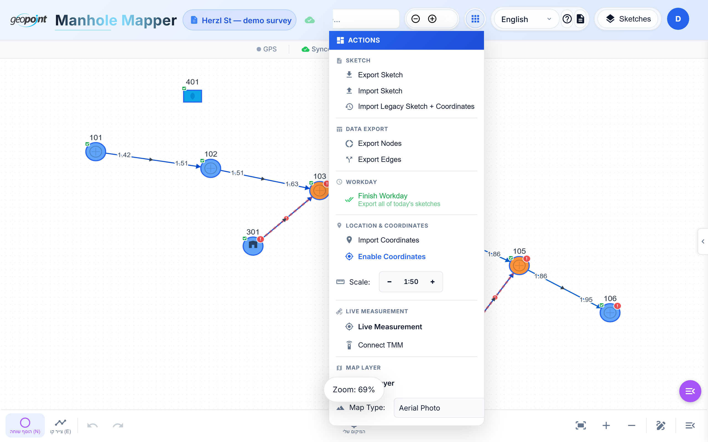

# Tutorial 8 — Export & Import

Everything you survey leaves the app cleanly: CSV for GIS, JSON for backup
and transfer, and a wizard for migrating legacy data in.

## Export menu

Open the export dropdown in the header:

### CSV for ArcGIS

Two files, designed to import directly:

- **Nodes CSV** — IDs, ITM coordinates, node type, and every configured
  attribute (materials/statuses exported with their admin-configured codes).
- **Edges CSV** — connectivity (from/to node IDs), depths at both ends,
  diameter, material, line type.

Which columns are included is configurable per organization in the admin
settings. Exports are formula-injection-safe and encoded UTF-16LE so Hebrew
text opens correctly in Excel.

### Sketch JSON

**Export sketch** downloads the complete sketch (schema v1.1) — geometry,
attributes, measurement history, everything. Use it for backup, transfer
between accounts, or attaching to a report. **Import sketch** restores it.

> Feature flags: your admin may enable/disable CSV or sketch export per user
> ([Tutorial 7](07-projects-and-teams.md)).

## Automatic backups

Beyond cloud sync, the app keeps local hourly/daily backups (IndexedDB) as a
last-resort safety net.

## Finish workday

The **Finish workday** flow (menu) is the end-of-day checklist: it walks
through unresolved dangling edges and incomplete nodes so nothing half-drawn
leaves the field. Pair it with the heat map
([Tutorial 3](03-entering-field-data.md)) before driving home.

## Migrating legacy data

For sketches created before the app had coordinates (old canvas JSON) plus a
separately measured ITM CSV:

**Menu → Sketch → "Import Legacy Sketch + Coordinates"**

The wizard takes both files, matches points to nodes by ID, and propagates
positions to unmatched nodes through the network (BFS), producing a fully
geo-referenced sketch. Details: [LEGACY_IMPORT_GUIDE.md](../LEGACY_IMPORT_GUIDE.md).

---

*That's the full tour. For developer-facing docs — architecture, API,
database, testing — start at [docs/ARCHITECTURE.md](../ARCHITECTURE.md) and
[CLAUDE.md](../../CLAUDE.md).*
