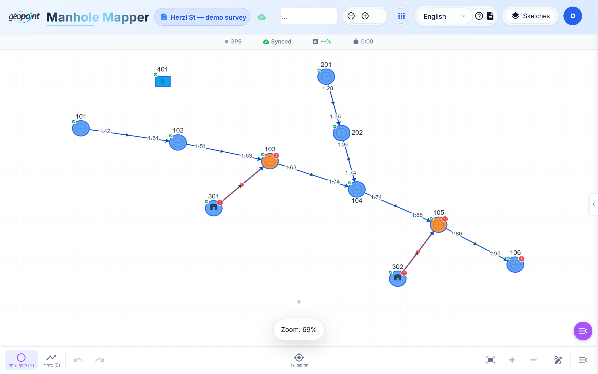

# Manholes Mapper — Tutorials

A hands-on guide to surveying underground infrastructure with the Manholes Mapper PWA — from your first sketch to survey-grade GNSS capture, 3D inspection, and GIS export.



## Who this is for

Field surveyors, GIS operators, and project managers using the app at
**https://manholes-mapper-three.vercel.app** — on a desktop browser, an Android
phone, or a Trimble TSC5 controller. No prior experience with the app is
assumed.

## The tutorials

| # | Tutorial | You will learn |
|---|----------|----------------|
| 1 | [Getting started](01-getting-started.md) | Signing in, the main screen, sketches, offline behavior, language & dark mode |
| 2 | [Your first sketch](02-your-first-sketch.md) | Creating a sketch, placing manholes, drawing pipes, node types, undo |
| 3 | [Entering field data](03-entering-field-data.md) | The details drawer, the field stepper, pipe depths, completeness heat map |
| 4 | [Coordinates & map layers](04-coordinates-and-maps.md) | Importing ITM coordinates, background maps, reference layers, your location |
| 5 | [Survey mode: TSC3 & GNSS](05-survey-mode.md) | Connecting survey hardware, live RTK capture, Z-aware auto-connect, measurement history |
| 6 | [The 3D underground view](06-3d-view.md) | Fly-through inspection, camera modes, issues in 3D |
| 7 | [Projects, teams & admin](07-projects-and-teams.md) | Projects, the project canvas, roles, sketch locking, admin settings |
| 8 | [Export & import](08-export-import.md) | CSV export for ArcGIS, sketch backup, legacy data migration |

Read them in order if you're new — each builds on the previous one. Every
tutorial is self-contained enough to use as a reference later.

## Conventions

- **Keyboard keys** are shown as `N`, `E`, `Ctrl+Z`.
- The app is fully bilingual (Hebrew ⇄ English, RTL-aware). Screenshots here
  use the English UI; switch languages any time from the header dropdown.
- Anything you do works **offline** — data persists on the device and syncs to
  the cloud when connectivity returns.

## About the screenshots

All screenshots are generated from a scripted demo session against a local dev
server with a fully mocked backend (no production data). To regenerate after a
UI change:

```bash
npm run dev                        # terminal 1
node scripts/docs-screenshots.mjs  # terminal 2 — writes docs/tutorials/images/
```

Pass scene names to re-shoot a subset, e.g.
`node scripts/docs-screenshots.mjs network details`.
